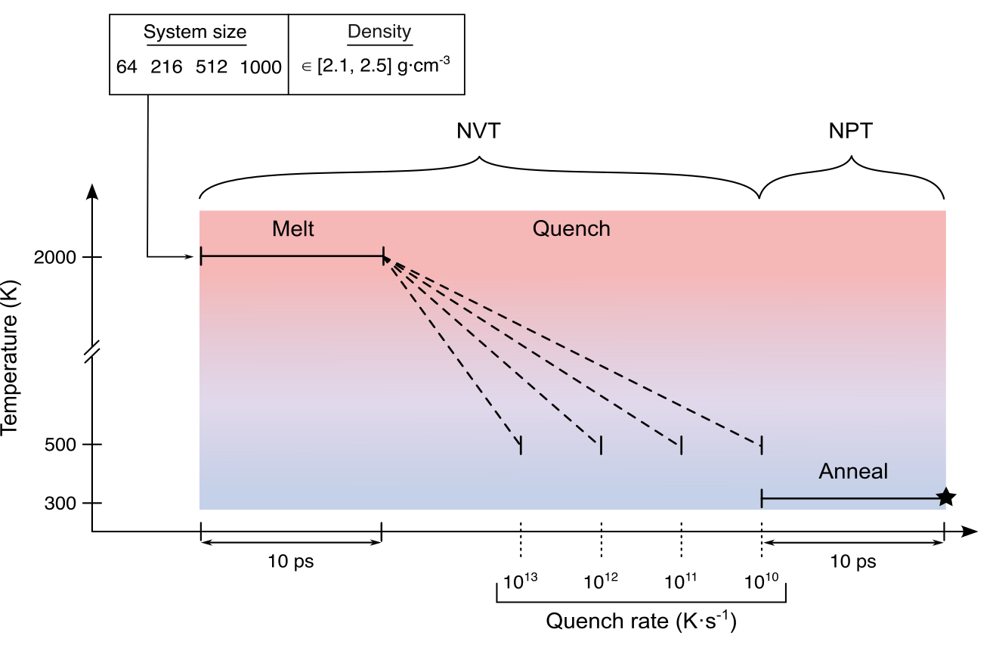

# Research data supporting "Signatures of paracrystallinity in amorphous silicon"
This dataset supports the following study: https://www.nature.com/articles/s41467-025-57406-4


## Dataset ranging from disorder to order
The dataset contains 3,069 a-Si structures, for a total of approximately 1.3 million atomic environments. These structures range from highly disordered to more crystalline-like. It is separated into `.xyz` files for each cell structure size.

A pickled dataframe is also provided with additional information on the structures, which can be loaded with `pandas` as follows:

```python
import pandas as pd
df=pd.read_pickle('./data/df_rev1.pckl.gzip',compression="gzip")
df.keys()
```

    Index(['ase_atoms', 'nb_atoms', 'size', 'vol_per_atom', 'label', 'nnb',
       'Category_2', 'Category_color_2', 'gap_energy', 'dE_gap', 'gap_at_E_NN',
       'mtp_energy', 'dE_mtp', 'mtp_at_E_NN', 'forces', 'F_max',
       'soap_sim_cSi', 'atomistic_soap_sim_cSi', 'PTM', 'CNA', 'stein_sim'],
      dtype='object')

## Selected structures
We analyze four structural models (denoted **I** through **IV**) of 1,000 atoms of increasing paracrystallinity, which corresponds to the indices `2512`, `2545`, `2561` and `2568` of the dataframe, respectively.

We also compare prototypical structures from each category: thse indices are `2491` for CRN, `2576` for Paracrystalline and `2604` for Polycrystalline. 

## Large-scale structures
We also provide larger structural models of 100,000 atoms, namely a paracrystalline and a polycrystalline structure generated with quench rates of $10^{11}$ (top) and $10^{10}$ K/s (bottom) respectively. 


## Structure generation
All structures were generated following the protocol described in the manuscript. These simulations were carried out in [LAMMPS](https://www.lammps.org/) using the $M_{16}^{''}$ [ML potential](https://doi.org/10.1063/5.0099929). Only the ultimate frame from each trajectory was added to the database, as shown below:




## Data analysis
Scripts for the analysis and plotting of all figures in the manuscript are provided in the [scripts](./scripts) and [src](./src) folders.
